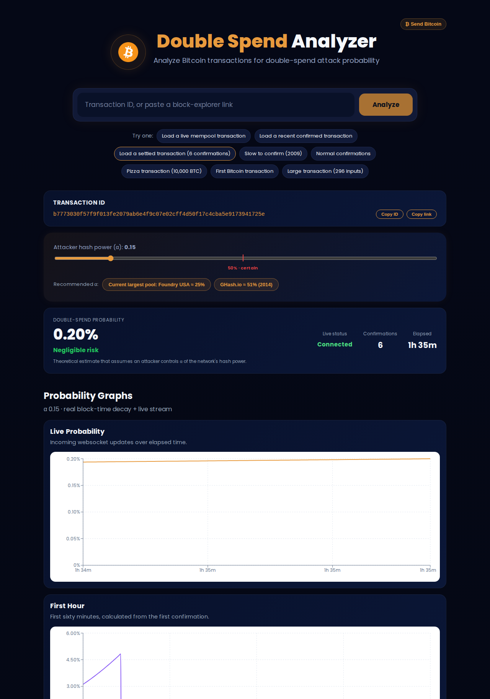

# Bitcoin Double-Spend Risk

A real-time web app that estimates the probability a Bitcoin transaction could
still be **double-spent** (reversed by an attacker mining a competing chain),
and streams that probability live as time passes and confirmations accumulate.

> **Live demo:** https://bitcoin-double-spend-website.vercel.app
>
> The probability model is real applied math. In demo mode, sample transactions
> are simulated so the app runs anywhere with no Bitcoin node; in `esplora` mode
> it uses real mainnet data (including live mempool transactions) through a free
> public API, still with no node required.



---

## What it does

- Look up a transaction by id and see its inputs, outputs, and estimated fee.
- Watch a **live double-spend probability** update over a WebSocket as the
  transaction ages and confirms.
- One-click loaders: a live mempool (unconfirmed) transaction, a just-confirmed
  one, or a settled one (6 confirmations, the conventional "safe" depth).
- Explore probability-decay graphs built from the transaction's real
  confirmation timeline (first hour, first 5 hours, and full history),
  downsampled with the LTTB algorithm so large series stay smooth.
- Adjust the attacker's assumed hash-power share (α) and see the risk
  recompute, with live presets like the current largest mining pool's share.

## The model

Given how long a transaction has been visible (`t`), its confirmation count
(`n`), and an attacker's share of network hash power (`α`), the app computes
the probability the attacker could still build a longer chain and reverse it.
The catch-up formula applies while the attacker is a minority (`0 < α < 0.5`);
at `α ≥ 0.5` a majority attacker always out-mines the network eventually, so
the risk is reported as a certain 100%. The calculation runs in log-space for
numerical stability when the probability becomes astronomically small. See
[`backend/app/probability/equations.py`](backend/app/probability/equations.py).

A subtle, correct property the tests pin down: with confirmations held fixed,
risk *rises* with elapsed time (the attacker gains ground), but in practice
confirmations arrive faster than that effect, so the live curve trends down.

## Architecture

```
React + TypeScript (Vite)          FastAPI (Python)                Probability engine
┌────────────────────┐   HTTP/WS  ┌──────────────────┐  interface ┌──────────────────┐
│ charts, live stream │ ─────────▶ │ REST + WebSocket  │ ─────────▶ │ demo simulator   │
│ (Recharts)          │           │ routes            │           │  ── or ──         │
└────────────────────┘           └──────────────────┘           │ live Bitcoin RPC │
                                                                  └──────────────────┘
```

The API depends only on a `BitcoinSource` interface. Three implementations plug
in behind it, chosen by config:

- **`demo`** (default): a self-contained simulator with sample transactions.
  No node, no blockchain download, safe to deploy publicly.
- **`esplora`**: real mainnet data via the free public mempool.space /
  Blockstream API, including live mempool (unconfirmed) transactions. No node,
  no API key.
- **`rpc`**: a real, fully-synced Bitcoin Core node (`txindex=1`, JSON-RPC).

Swapping them is a single environment variable (`DSCAP_DATA_SOURCE`), which is
what makes the project both a live demo and a real tool.

```
backend/    FastAPI app, probability engine, data sources, tests
frontend/   React + TypeScript SPA (Vite + Recharts)
docker-compose.yml, .github/workflows/ci.yml
```

## Run it locally

### Option A: Docker (both services)

```bash
docker compose up --build
# frontend → http://localhost:8080
# api      → http://localhost:8000
```

### Option B: run each service directly

Backend:

```bash
cd backend
python3 -m venv .venv && source .venv/bin/activate
pip install -r requirements-dev.txt
cp .env.example .env            # defaults to demo mode
uvicorn app.main:app --reload   # http://localhost:8000
```

Frontend:

```bash
cd frontend
npm install
cp .env.example .env            # VITE_API_BASE_URL=http://localhost:8000
npm run dev                     # http://localhost:5173
```

## Tests

```bash
cd backend && source .venv/bin/activate && pytest -q   # math + API
cd frontend && npm run build                           # type-check + bundle
```

## Using a real Bitcoin node

Set these in `backend/.env` (never commit real credentials):

```
DSCAP_DATA_SOURCE=rpc
DSCAP_RPC_USER=...
DSCAP_RPC_PASSWORD=...
DSCAP_RPC_HOST=127.0.0.1
DSCAP_RPC_PORT=8332
```

The node must be fully synced with `server=1` and `txindex=1` (needed to look up
arbitrary transactions by id).

## Deploying

- **Frontend** → any static host (Vercel, Netlify, Cloudflare Pages). Set
  `VITE_API_BASE_URL` to the deployed API URL at build time.
- **Backend** → any container host (Fly.io, Railway, Render). Set
  `DSCAP_CORS_ORIGINS` to the deployed frontend origin.

The live site runs `DSCAP_DATA_SOURCE=esplora`: real mainnet data through the
free mempool.space API, no node required. Use `demo` for a deployment with zero
external dependencies (e.g. an offline or CI environment).
